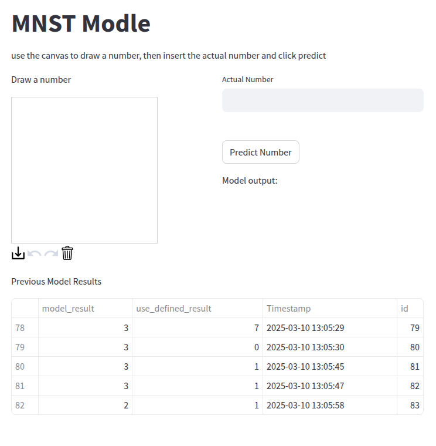

# Machine Learning Institute - Personal Project

A web application that uses a Convolutional Neural Network (CNN) to recognize hand-drawn digits, built with PyTorch, FastAPI, and Streamlit.

[Live Application Link](http://188.245.172.187/)

## Getting Started

1. Clone the repository
2. Install Docker and Docker Compose
3. Run the application:
```bash
docker compose up --build
```

### Requirements
- Docker Engine 24.0.0+
- Docker Compose v2.0.0+
- 4GB RAM minimum
- 2GB free disk space

## Usage

1. Access the web interface at http://localhost:8000
2. Draw a number (0-9) on the canvas
3. Enter the actual number you drew
4. Click "Predict Number" to see the model's prediction
5. Previous results are displayed in a table below

## Model Information

The CNN model is trained on the MNIST dataset and achieves ~98% accuracy. It consists of:
- 2 Convolutional layers
- ReLU activation functions
- Fully connected output layer

## Technologies Used
- PyTorch - Deep learning framework
- FastAPI - AI service API
- Streamlit - Web interface
- PostgreSQL - Results storage
- Docker - Containerization

## Project Structure
- `AI/` - Neural network model and FastAPI service
- `web/` - Streamlit web interface
- `db/` - PostgreSQL database schemas and utilities

## Architecture

The project consists of three main services:
- Web UI (Streamlit) - Port 8000
- AI Service (FastAPI) - Internal
- Database (PostgreSQL) - Internal

## Screenshots

*Drawing canvas and prediction interface*

## MNIST Dataset Preprocessing
[Link](https://www.lri.fr/~marc/Master2/MNIST_doc.pdf#:~:text=The%20original%20black%20and%20white,center%20of%20the%2028x28%20field) to "The digits have been size-normalized and centered in a fixed-size image. The original black and white (bilevel) images from NIST were size normalized to fit in a 20x20 pixel box while preserving their aspect ratio. The resulting images contain grey levels as a result of the anti-aliasing technique used by the normalization algorithm. the images were centered in a 28x28 image by computing the center of mass of the pixels, and translating the image so as to position this point at the center of the 28x28 field."